<div align="center">

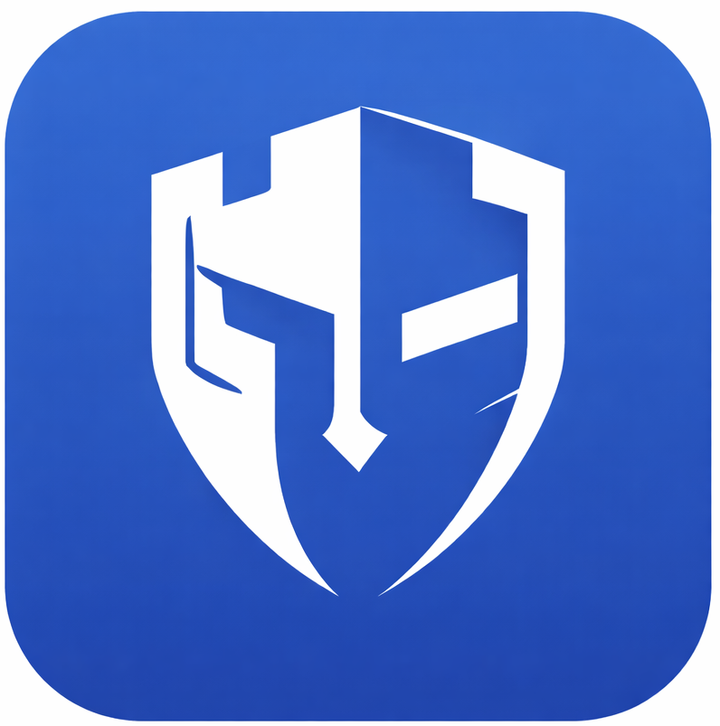


**A beautiful, secure, cross-platform password manager.**

Windows desktop app · Chrome extension · iOS & Android mobile app · iOS Autofill provider · Windows service · all sharing one encrypted vault.

[Status](#project-status) · [Screenshots](#screenshots) · [Features](#features) · [On-device AI](#on-device-ai) · [Architecture](#architecture) · [Getting started](#getting-started) · [Project layout](#project-layout) · [Security](#security-model)

</div>

---

## Project status

> **Only the mobile app ([Fortress.Mobile](Fortress.Mobile/) / [Fortress.Mobile.Core](Fortress.Mobile.Core/)) is feature-complete today.** The other clients in this repo — the WPF Windows desktop app, the Chrome extension, the Windows service, the native messaging host, and the iOS Autofill extension — are still **work in progress** and are not guaranteed to build or run end-to-end yet. Everything below describes the *intended* shape of the system; the screenshots reflect what actually ships.

---

## Why Fortress

Most password managers are either a polished cloud product you have to trust, or an open-source tool that feels like one. Fortress is built to be both — a fully native experience on every surface you use (Windows, browser, iPhone, Android), with vault storage and crypto that you own end-to-end.

Vaults are encrypted on-device. Sync is optional and goes through *your* Google Drive / OneDrive / Dropbox — there is no Fortress server.

## Features

- **Cross-platform clients** — WPF desktop app for Windows, .NET MAUI app for iOS and Android, and a Chrome MV3 browser extension. All speak the same vault format.
- **End-to-end encryption** — AES vault encryption with a password-derived key; the wire format is identical across the desktop, mobile, and browser implementations, so vaults are portable.
- **Two browser modes** — connect to the local Windows service for hardware-backed storage, or run fully standalone with Web Crypto (PBKDF2 + AES-GCM) and `chrome.storage.local`.
- **iOS Autofill** — native `ASCredentialProviderExtension` integration so credentials and one-time codes show up in the system QuickType bar.
- **Android Autofill + Credentials** — uses `androidx.autofill` and `androidx.credentials` for system-level fill on apps and the browser.
- **Biometric & PIN unlock** — Windows Hello on desktop, Face ID / Touch ID on iOS, BiometricPrompt on Android, plus 4-digit PIN fallback.
- **Item types** — logins, credit cards, identities, secure notes, TOTP authenticators, passkeys.
- **Cloud sync** — Google Drive, OneDrive, and Dropbox provider plumbing built in; you bring your own account.
- **Vault health** — password strength scoring, reuse detection, Have-I-Been-Pwned-style breach lookup, and anomaly detection.
- **On-device AI** — voice commands, semantic search, phishing & autofill risk scoring, and access-pattern anomaly detection, all running locally on the device. See [On-device AI](#on-device-ai).
- **Item sharing & groups** — share individual items or full groups between vaults.
- **Import & export** — bring in vaults from common password managers; export over USB for offline transfer.

## Screenshots

> Screenshots below cover the Android build of **Fortress.Mobile** and the WPF **Fortress.Windows.Desktop** app. Screenshots for the browser side panel and the iOS build will be added once those clients reach the same state.

### Mobile (Android)

<table>
  <tr>
    <td>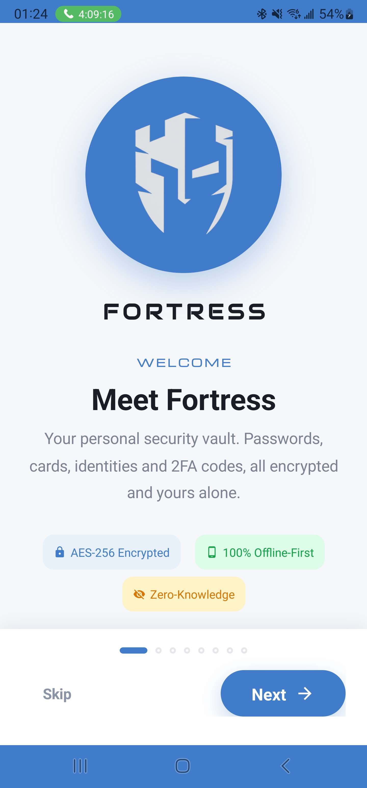</td>
    <td>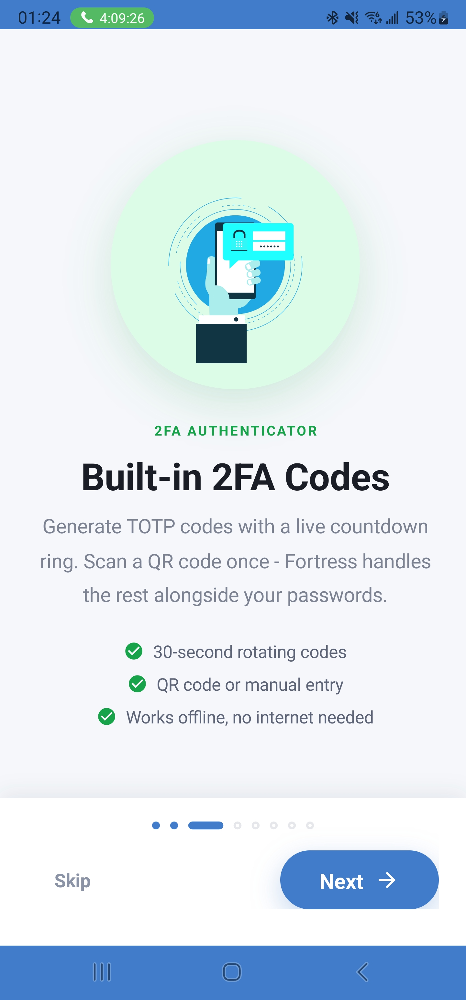</td>
    <td>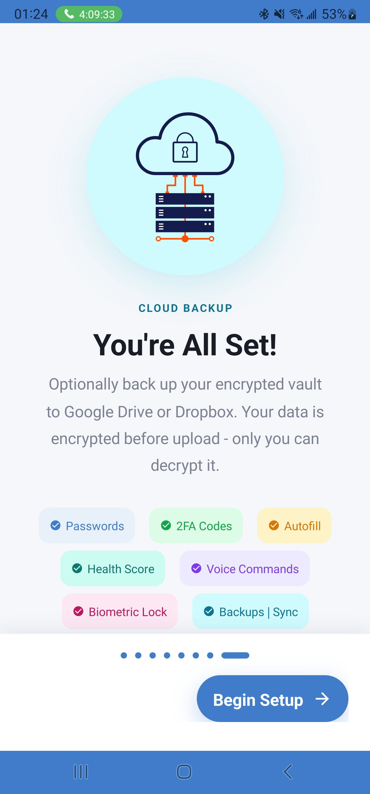</td>
    <td>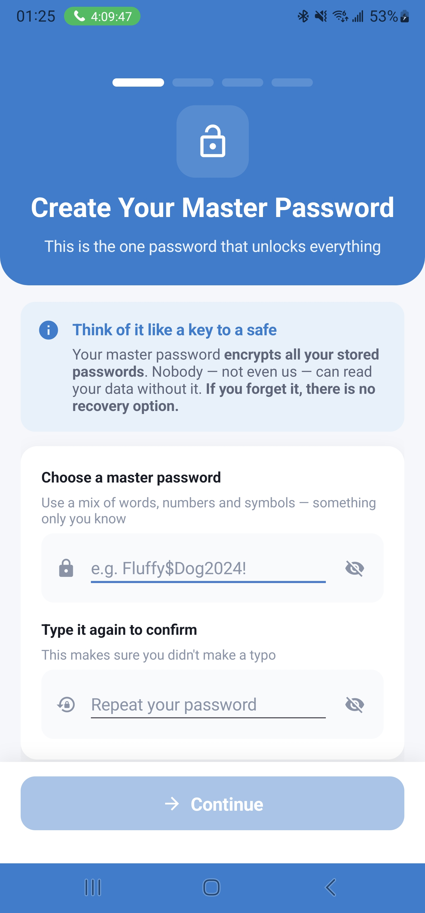</td>
  </tr>
  <tr>
    <td>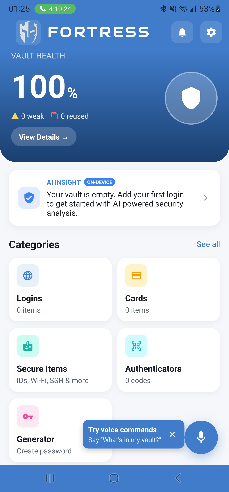</td>
    <td>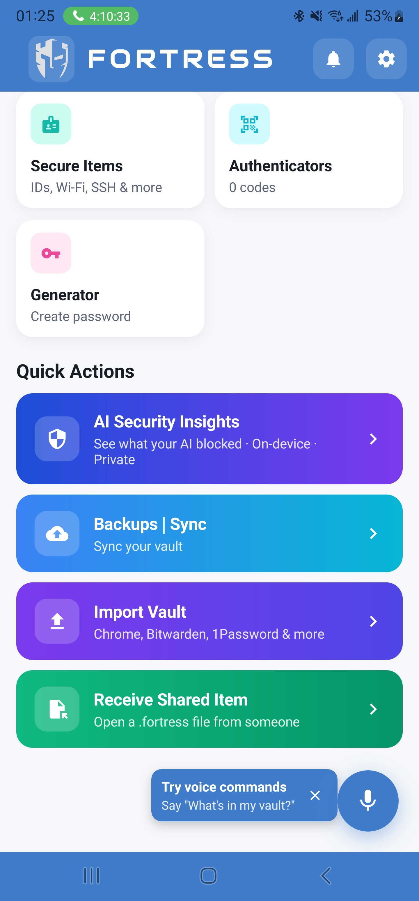</td>
    <td>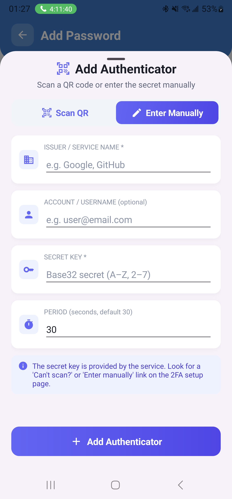</td>
    <td>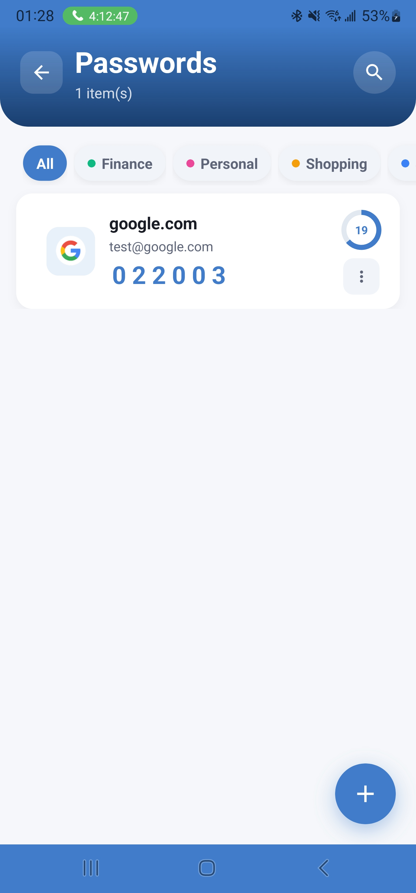</td>
  </tr>
  <tr>
    <td>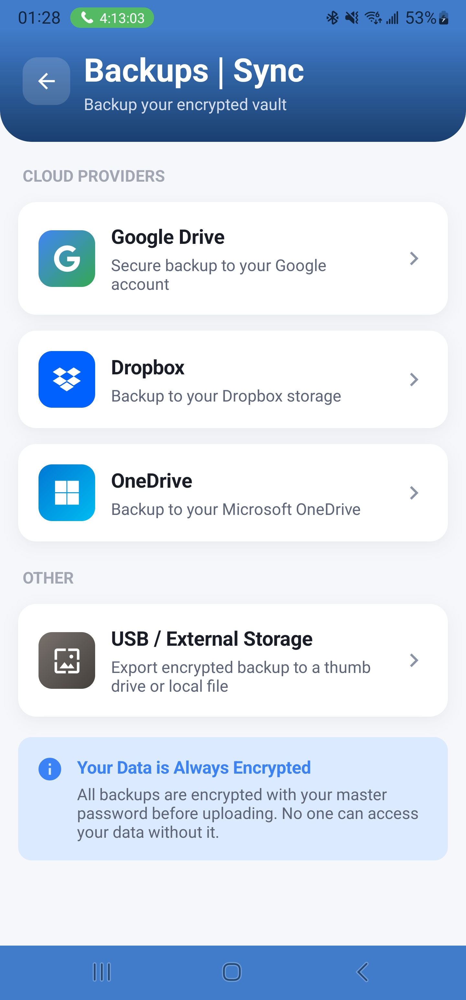</td>
    <td>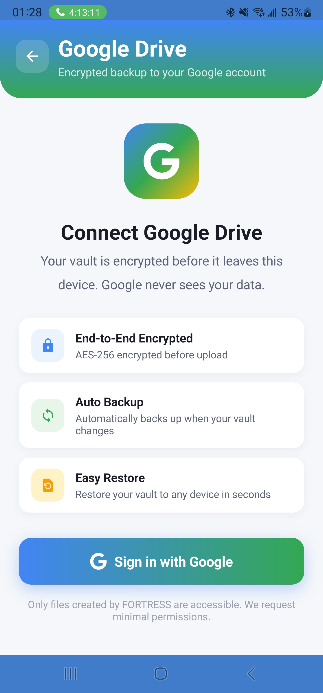</td>
    <td>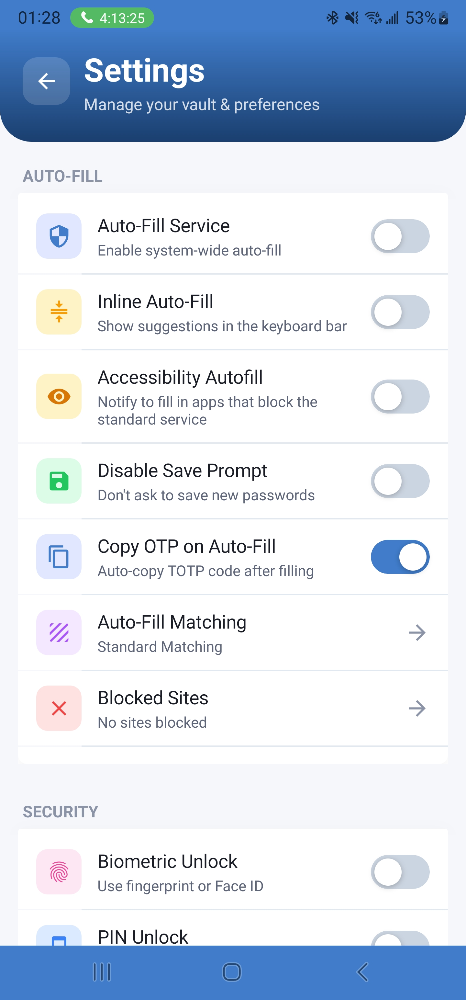</td>
    <td>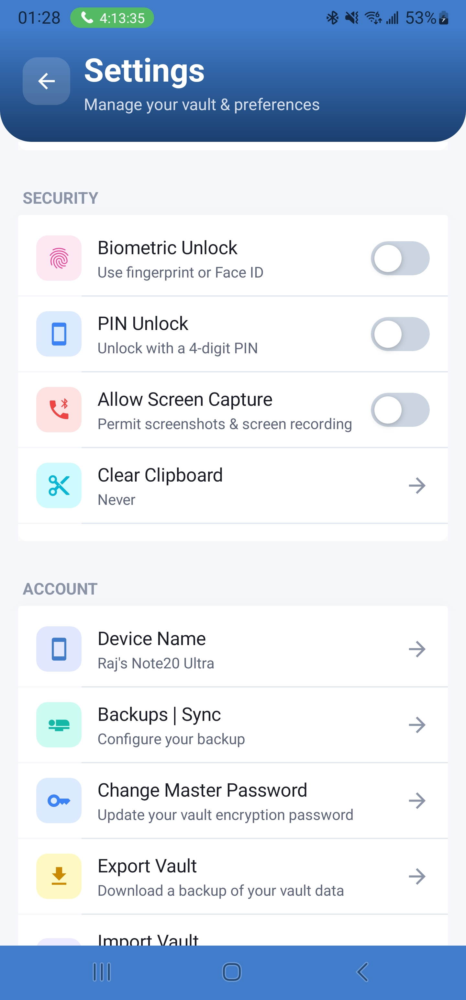</td>
  </tr>
  <tr>
    <td>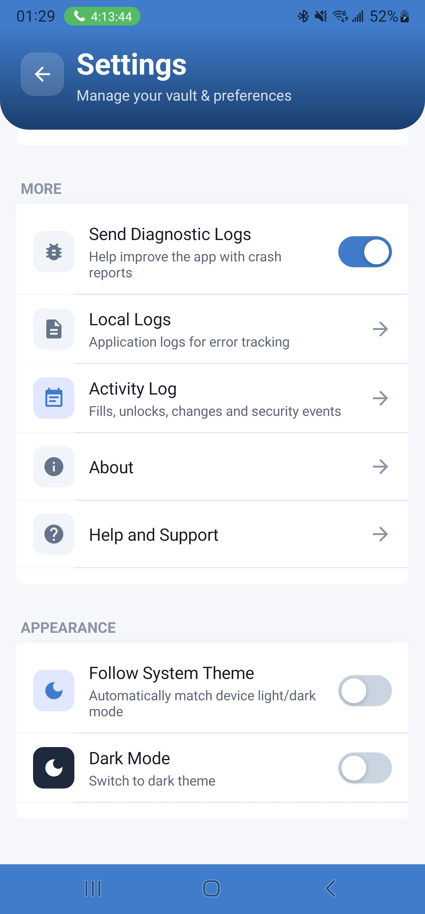</td>
    <td></td>
    <td></td>
    <td></td>
  </tr>
</table>

### Windows desktop (WPF)

<table>
  <tr>
    <td>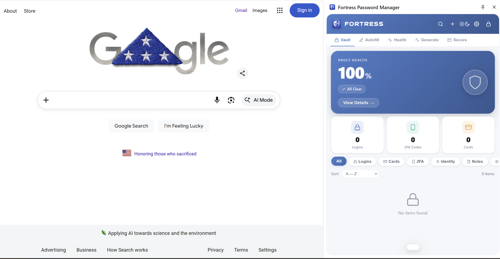</td>
    <td>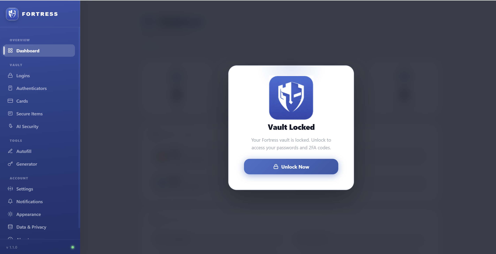</td>
    <td>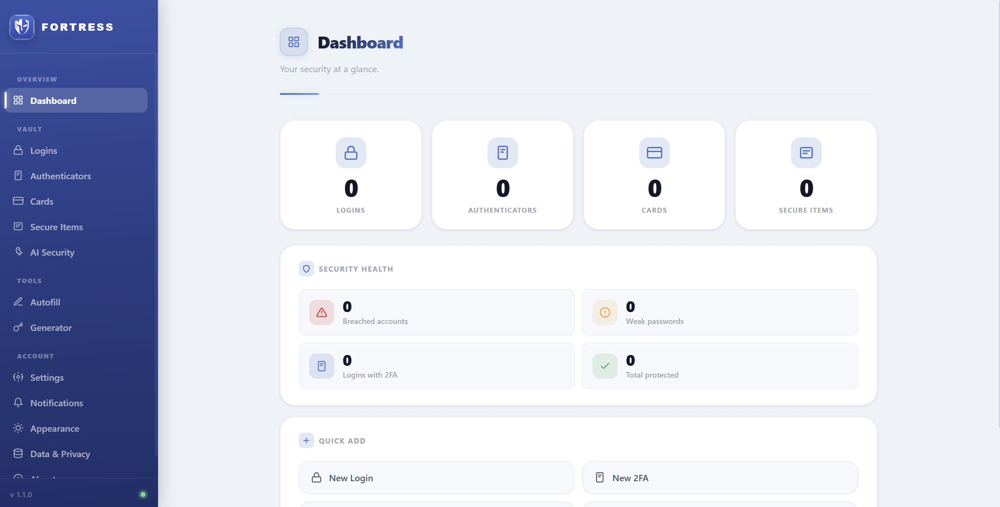</td>
  </tr>
  <tr>
    <td>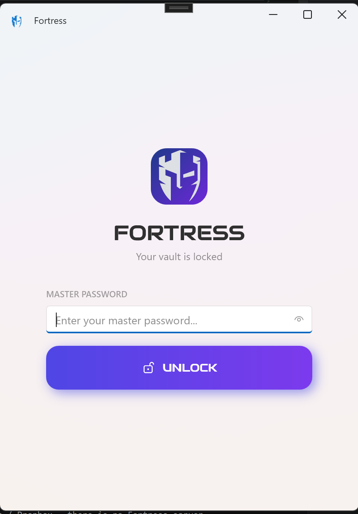</td>
    <td>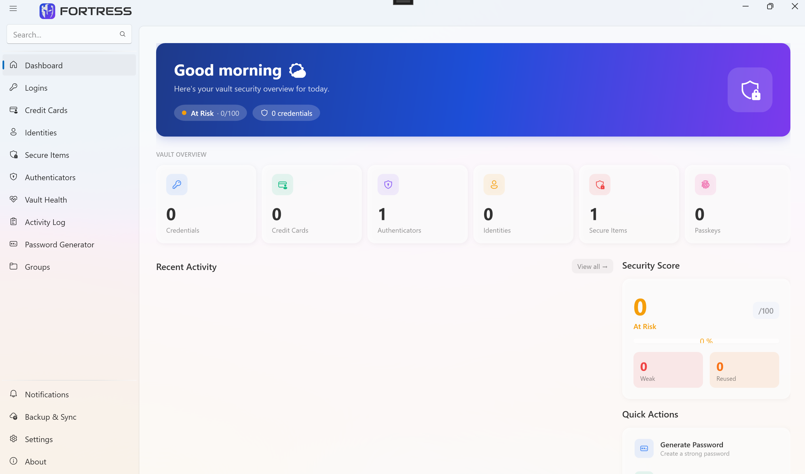</td>
    <td>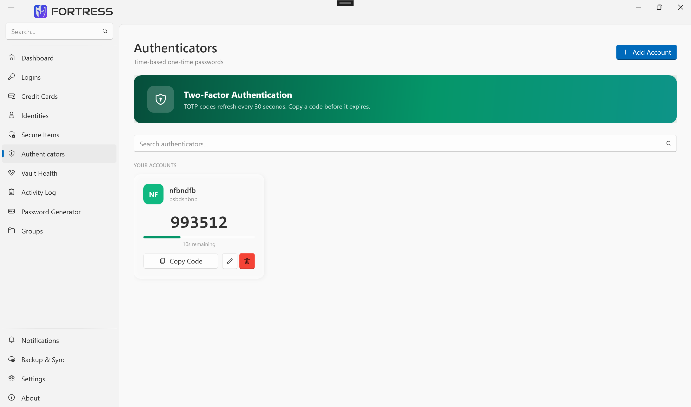</td>
  </tr>
</table>

## On-device AI

Fortress ships several AI / ML features in the mobile app. **Every model runs locally on the phone** — no requests to OpenAI, Azure, Gemini, Anthropic, or any other hosted inference service, and no plaintext vault data ever leaves the device for an AI to look at. Models are bundled into the app package or built from your own vault at runtime.

The stack is **[Microsoft ML.NET 4.0.2](https://github.com/dotnet/machinelearning)** for classifiers and time-series detectors, **[ONNX Runtime 1.20.1](https://github.com/microsoft/onnxruntime)** for the optional phishing model, and the native platform speech-to-text APIs (`SpeechRecognizer` on Android, `SFSpeechRecognizer` on iOS) for voice input.

| Feature | What it does | How it works |
|---|---|---|
| **Voice commands** | Speak things like *"show my vault health"* or *"add a password"* to drive the app hands-free. | Three-tier pipeline: keyword matcher → ML.NET SDCA multiclass classifier (`Resources/Raw/intent_classifier_v1.zip`, trained by [Fortress.ModelTrainer](Fortress.ModelTrainer/)) → TF-IDF cosine-similarity fallback for paraphrases. See [MlNetIntentClassifier.cs](Fortress.Mobile.Core/Services/MlNetIntentClassifier.cs), [VoiceCommandRouter.cs](Fortress.Mobile.Core/Intelligence/VoiceCommandRouter.cs), [SemanticIntentFallback.cs](Fortress.Mobile.Core/Intelligence/SemanticIntentFallback.cs). |
| **Smart search** | Type *"my bank account"* and get vault items ranked by meaning, not just keyword match. | TF-IDF semantic vectors with bigram + char-n-gram features and cosine similarity, built from the live vault at unlock time. See [SemanticVaultSearch.cs](Fortress.Mobile.Core/Intelligence/SemanticVaultSearch.cs). |
| **Phishing URL detection** | Warns before autofilling into a look-alike or known-bad domain. | Hand-engineered URL features (length, subdomain depth, suspicious TLDs, Levenshtein distance to brand names, HTTPS, IP-as-host, etc.) scored by ML.NET. An optional ONNX model (`Resources/Raw/phishing_url_v1.onnx`) raises accuracy when present. See [PhishingUrlScorer.cs](Fortress.Mobile.Core/Intelligence/PhishingUrlScorer.cs). |
| **Autofill risk engine** | Decides whether autofilling on a given form is safe. | ML.NET logistic-regression classifier over domain-match, punycode tricks, field hints, form-hash history, prior-success signals, and time-of-day. See [AutofillRiskEngine.cs](Fortress.Mobile.Core/Intelligence/AutofillRiskEngine.cs). |
| **Access-pattern anomaly detection** | Flags suspicious vault access — unusual frequency spikes, odd time-of-day, sustained behavioral shifts. | ML.NET TimeSeries `DetectIidSpike` + `DetectChangePointBySsa` over local access-event logs. See [AccessPatternAnomalyDetector.cs](Fortress.Mobile.Core/Services/AccessPatternAnomalyDetector.cs). |
| **Weak-password outlier detection** | Surfaces passwords that are weak *relative to the rest of your vault*, not just below a fixed threshold. | ML.NET TimeSeries SSA spike detection (`DetectSpikeBySsa`, 95% confidence) over per-item strength scores. See [PasswordAnomalyDetector.cs](Fortress.Mobile.Core/Services/PasswordAnomalyDetector.cs). |
| **Item auto-tagging** | Auto-assigns icon, criticality, and tags (email, finance, crypto, identity provider…) when you save a new item. | Deterministic domain / title heuristics — no model, but documented here so the behavior is discoverable. See [ItemClassifier.cs](Fortress.Mobile.Core/Intelligence/ItemClassifier.cs). |
| **Vault-health score** | Single 0–100 score with ranked findings (weak, reused, breached, anomalous). | Pure algorithmic scoring that *consumes* `PasswordAnomalyDetector` when ML features are enabled. See [VaultHealthCalculator.cs](Fortress.Mobile.Core/Services/VaultHealthCalculator.cs). |

The intent-classifier model is regenerated at build time by [Fortress.ModelTrainer](Fortress.ModelTrainer/); the `TrainIntentModel` MSBuild target in [Fortress.Mobile.csproj](Fortress.Mobile/Fortress.Mobile.csproj) runs the trainer before the app build whenever the trainer project is present, then bundles `intent_classifier_v1.zip` as a `MauiAsset`.

## Architecture

```
                                                                      ┌──────────────────────┐
                                                                      │   Chrome MV3 ext.    │
                                                                      │  (Fortress.Browser-  │
                                                                      │     Extension)       │
                                                                      └──────────┬───────────┘
                                                                                 │  Native Messaging
                                                                                 ▼
┌────────────────────┐    Named Pipe       ┌──────────────────────┐    stdin/stdout
│  Fortress.Windows. │ ◄──── (raw bytes)──►│   Fortress.Service   │ ◄──────────────────────────┐
│      Desktop       │                     │  (Windows Service,   │                            │
│       (WPF)        │                     │   vault + crypto)    │                            │
└────────────────────┘                     └──────────────────────┘                  ┌─────────┴─────────┐
                                                      ▲                              │ Fortress.Native-  │
                                                      │                              │  MessagingHost    │
                                                      │                              └───────────────────┘
                                                      │
                                                      │ shared vault file format
                                                      │
                       ┌──────────────────────────────┴────────────────────────────────┐
                       │                                                               │
              ┌────────▼────────┐                                          ┌───────────▼─────────┐
              │    Fortress.    │                                          │   Fortress.iPhone.  │
              │      Mobile     │  ──── iOS shared keychain group ─────►   │      Autofill       │
              │  (iOS / Android)│                                          │   (ASCredential-    │
              └─────────────────┘                                          │      Provider)      │
                                                                           └─────────────────────┘
```

The vault crypto and binary wire format are implemented identically in [Fortress.Core](Fortress.Core/Security/VaultCryptoService.cs) (C# desktop/service) and the mobile core, so a vault written on one platform unlocks on any other.

## Project layout

| Project | Stack | What it is |
|---|---|---|
| [Fortress.Core](Fortress.Core/) | .NET class library | Vault models, crypto, storage, password generation, breach lookup, vault-health scoring. Shared by desktop and service. |
| [Fortress.Service](Fortress.Service/) | .NET worker service | Windows service. Owns the vault on disk and exposes it over a local named pipe. Runs background workers for event-log trimming and health snapshots. |
| [Fortress.NativeMessagingHost](Fortress.NativeMessagingHost/) | .NET console exe | Native Messaging bridge. Chrome spawns it; it relays JSON between the extension and the service's named pipe. |
| [Fortress.Windows.Desktop](Fortress.Windows.Desktop/) | WPF + WPF-UI + HandyControl | Windows desktop client. Talks to **Fortress.Service** for vault access. |
| [Fortress.BrowserExtension](Fortress.BrowserExtension/) | Chrome MV3 (JS) | Side-panel extension with autofill, save-prompt, item management. Runs in **service mode** (via native messaging) or **standalone mode** (Web Crypto + `chrome.storage.local`, optional Google Drive sync). |
| [Fortress.Shared](Fortress.Shared/) | .NET class library | Types shared between the service and the host. |
| [Fortress.Mobile](Fortress.Mobile/) | .NET MAUI (net10.0-ios / net10.0-android) | Mobile app for iOS and Android. Same vault format as desktop. |
| [Fortress.Mobile.Core](Fortress.Mobile.Core/) | .NET class library | Mobile crypto, storage, models, intent classifier. |
| [Fortress.iPhone.Autofill](Fortress.iPhone.Autofill/) | Xamarin.iOS App Extension | iOS `ASCredentialProviderExtension` that surfaces vault entries in the system Autofill picker. |

## Security model

### Vault field crypto

Every sensitive field inside a vault item — passwords, card numbers, CVVs, TOTP secrets, secure-note bodies, SSH keys — is encrypted independently before being written to the LiteDB file.

| Component | Choice | Why |
|---|---|---|
| KDF | **Argon2id**, `t=3, m=64 MiB, p=4` → 32 bytes | Memory-hard; defeats GPU/ASIC brute force. OWASP 2023 recommended minimum + margin. |
| Cipher | **AES-256-GCM**, 12-byte random IV per field | Authenticated encryption — any tampering with the ciphertext is detected and decrypt throws. |
| Wire format | `Base64( [magic "F2" (2)] [version (1)] [iv (12)] [ciphertext] [tag (16)] )` | Self-describing; the version byte lets a future v3 coexist and be detected on read. |

The Argon2id derivation uses a constant domain-separation salt; memory hardness makes per-vault salt unnecessary for the threat model (any precompute attack would have to pay the 64 MiB cost per candidate password). A future v3 may add per-vault random salt.

Implementation: [Fortress.Core/Security/VaultCryptoService.cs](Fortress.Core/Security/VaultCryptoService.cs) and the byte-for-byte mirror in [Fortress.Mobile.Core/Services/CryptographyService.cs](Fortress.Mobile.Core/Services/CryptographyService.cs). A vault written on any platform decrypts on any other.

### Other layers

- **LiteDB file encryption** — the database file itself is AES-encrypted with a per-vault random 256-bit key stored in `preferences.json` (`pref_dbFileKey`). This is independent of the master password.
- **Browser standalone mode** — Web Crypto API: PBKDF2 (310 000 iterations) + AES-GCM, encrypted blob in `chrome.storage.local`. (Will migrate to Argon2id in a follow-up.)
- **IPC** — desktop ↔ service uses a local named pipe; browser extension ↔ service goes via Chrome Native Messaging then the same named pipe. Raw-byte framed JSON. No network listener is ever opened.
- **Biometric unlock** keeps a wrapped session key in platform secure storage (Windows Hello / DPAPI, iOS Keychain, Android Keystore via `androidx.security.crypto`). The master password is still required for the first unlock after a reboot.
- **Mobile** — vault lives in the app's sandboxed container; iOS Autofill reads it through a shared App Group / Keychain access group.
- **No telemetry, no Fortress backend.** Sync uses the user's own Google Drive / OneDrive / Dropbox account via OAuth.

See [SECURITY.md](SECURITY.md) for the vulnerability disclosure policy.

## Getting started

### Prerequisites

- **.NET SDK 10.0.102** (pinned via [global.json](global.json)) for the desktop, service, and MAUI projects.
- **.NET MAUI workload** — `dotnet workload install maui`.
- **Visual Studio 2022/2026** (recommended) with the *.NET Multi-platform App UI development* and *Mobile development with .NET* workloads, plus a Mac build host for iOS.
- **Chrome / Edge / any Chromium browser** for the extension.

### Clone

```powershell
git clone https://github.com/UmarLone/Fortress.git
cd fortress
```

### Build everything

```powershell
dotnet restore Fortress.sln
dotnet build   Fortress.sln -c Release
```

### Run the Windows desktop app

```powershell
dotnet run --project Fortress.Windows.Desktop -c Debug
```

The desktop app expects **Fortress.Service** to be running and reachable over its named pipe. For local dev you can run the service directly:

```powershell
dotnet run --project Fortress.Service -c Debug
```

### Build the mobile app

```powershell
# Android
dotnet build Fortress.Mobile -c Release -f net10.0-android

# iOS (requires a paired Mac with Xcode + valid provisioning profile)
dotnet build Fortress.Mobile -c Release -f net10.0-ios
```

The MAUI project targets **iOS 16+** and **Android 13+ (API 33)**.

### Load the browser extension

1. Build/copy `Fortress.BrowserExtension/src/` to a folder.
2. Open `chrome://extensions`, enable **Developer mode**, click **Load unpacked**, and select that folder.
3. (Optional, for service mode) Run `Fortress.NativeMessagingHost` once to register the `com.fortress.vault` native messaging host in the Windows registry, or run the included installer.
4. Pin the extension; it opens as a **side panel** (not a popup) when you click the action icon.

The extension works fully standalone — service mode is only required if you want the same vault as the desktop client.

## Repository layout

```
.
├── Fortress.BrowserExtension/        Chrome MV3 extension (side panel UI, content script, background worker)
├── Fortress.Core/                    Shared C# library (crypto, vault, health, breach lookup)
├── Fortress.NativeMessagingHost/     Browser ↔ service bridge
├── Fortress.Service/                 Windows service (named-pipe IPC, background workers)
├── Fortress.Shared/                  Shared types
├── Fortress.Windows.Desktop/         WPF desktop client
├── Fortress.Mobile/                  .NET MAUI app (iOS + Android)
├── Fortress.Mobile.Core/             Mobile shared library
├── Fortress.iPhone.Autofill/         iOS Autofill credential provider
├── Fortress.sln                      Solution file
└── global.json                       .NET SDK pin
```

## Contributing

Issues and pull requests are welcome. Please:

- Open an issue to discuss anything that touches the on-disk vault format or crypto before sending a PR.
- Keep platform-specific code under the relevant `Platforms/<OS>/` folder.
- Match the existing style — the desktop UI follows WPF-UI / HandyControl conventions; the MAUI app follows the look defined under `Resources/Styles/`.

## Acknowledgements

Built on a great pile of open-source work: .NET MAUI, WPF-UI, HandyControl, Prism, CommunityToolkit, Shiny, Syncfusion Toolkit, ZXing.Net.Maui, SkiaSharp, FFImageLoading, BouncyCastle, AndroidX Credentials & Autofill, and many more — see each project's `.csproj` for the full list.
